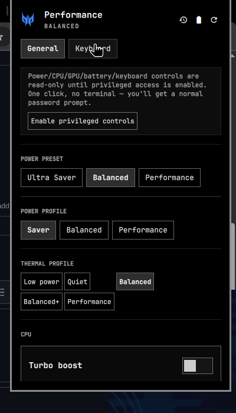
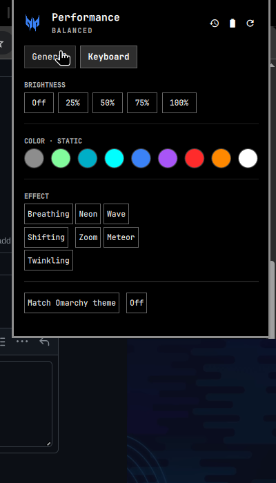

# Performance — for Acer Predator laptops

An [Omarchy](https://omarchy.org/) `omarchy-shell` plugin: a real power/CPU/GPU/battery/keyboard
control center in your bar, built specifically for **Acer Predator** laptops (and useful, minus
the Acer-only bits, on any Intel `intel_pstate` + RAPL laptop).

**Tested on: Acer Predator Helios Neo 16 (PHN16-71), Intel i5-13500HX, NVIDIA RTX 4050.**
Every control below — power presets, CPU turbo/cores/frequency/power-limit, thermal profile,
GPU mode switching, 80% battery charge limit, fan speed, and all four keyboard-RGB modes — was
verified working end to end on that exact model before this was published.



## Why

Windows has PredatorSense. Omarchy didn't have anything, so this ports the useful parts of it —
plus a few things PredatorSense doesn't even do (CPU core-count control, RAPL power-limit
presets) — into a proper bar widget that matches your theme.

## Install

```bash
omarchy plugin add https://github.com/Rezwoan/omarchy-predator-performance.git --enable --yes
```

That's it — **no terminal, no sudo, nothing else to run.** The panel works immediately in
read-only mode (live status only). The first time you want to actually *change* something,
click **Enable privileged controls** in the panel — that's a single native password prompt
(via polkit), not a command you type. See [How it works](#how-it-works) for why this is safe.

Optionally move it in the bar or bind a key to summon it:

```bash
omarchy bar move io.github.rezwoan.performance --section right
```

### Unlocking the Acer-only sections

Two optional AUR packages unlock more of the panel — everything else works without them:

| Package | Unlocks |
|---|---|
| `linuwu-sense-dkms` | Keyboard tab (RGB), 80% battery charge limit, fan speed |
| `envycontrol` | GPU mode switching (Integrated / Hybrid / Nvidia) |

If `linuwu-sense-dkms` is installed but the Keyboard tab still says it isn't detected, its
kernel module probably lost the race to the stock `acer_wmi` driver at boot — the panel detects
this and shows an **Enable keyboard RGB now** button that fixes it with, again, one click and
one password prompt. No manual `modprobe`/blacklist editing.

## What it does

**General tab**
- One-tap **Power Presets** — Ultra Saver / Balanced / Performance — each bundling CPU cores,
  turbo, frequency cap, RAPL power limit, thermal profile, keyboard color, and screen
  brightness. Persisted and silently reapplied on every boot.
- Power profile (power-profiles-daemon), thermal profile (every `platform_profile` your
  firmware exposes, not a hardcoded list)
- CPU: turbo boost, core mode (all / no hyperthreading / E-cores only), max frequency cap,
  RAPL package power limit
- GPU: mode switching (needs `envycontrol`), Nvidia dynamic-boost toggle
- Battery: live percentage/status, 80% charge-limit toggle, fan speed
- Session restore: reopens your open windows on next login

**Keyboard tab** (4-zone RGB)
- Brightness (5 steps), 9 static colors, 7 animated effects (Breathing / Neon / Wave /
  Shifting / Zoom / Meteor / Twinkling), match-current-theme, off

The bar icon is the Predator claw mark, recolored live to match your active mode — green for
battery saver, neon magenta for performance, blue for balanced, your theme's foreground color
otherwise.



## How it works

Every privileged write goes through one root-owned, verb-whitelisted script
(`/usr/local/bin/omarchy-perf-helper`) — it only accepts an exact, hardcoded set of
verbs/values (`turbo on|off`, `cpu-cores all|no-smt|ecore`, six-digit hex colors validated by
regex, etc.) and refuses everything else. It can't be redirected into running arbitrary
commands even though it runs as root.

Authorization is a **polkit action scoped to that exact binary path**
(`org.freedesktop.policykit.exec.path`), not a sudoers file. There is no passwordless
(`NOPASSWD`) rule anywhere — that's a deliberately avoided anti-pattern, not an oversight.
`polkit`'s `auth_admin_keep` means you authenticate once and it's remembered for a few minutes,
not on every single click, the same mechanism tools like GParted and Timeshift use. `setup.sh`
(what the "Enable privileged controls" button runs, via `pkexec`) installs the helper and this
policy — nothing is installed until you click that button.

## Uninstall

```bash
omarchy plugin remove io.github.rezwoan.performance
sudo rm -f /usr/local/bin/omarchy-perf-helper \
           /usr/share/polkit-1/actions/io.github.rezwoan.performance.helper.policy \
           /etc/systemd/system/omarchy-perf-restore.service
sudo systemctl daemon-reload
```
(The last three lines only apply if you'd clicked "Enable privileged controls" — skip them if
you never did.)

## Compatibility

| Feature | Requires |
|---|---|
| Bar icon, status, power presets, power profile | Any Omarchy 4.0.1+ install |
| Thermal profile, CPU turbo/cores/frequency, RAPL power limit | Intel CPU with `intel_pstate` + RAPL (most 8th-gen+ Intel laptops) |
| GPU mode switching, dynamic boost | NVIDIA Optimus laptop + `envycontrol` |
| Keyboard RGB, 80% battery limit, fan speed | Acer laptop + `linuwu-sense-dkms` |

Not an Acer Predator? The General tab (minus GPU/battery-limit/fan) still works on any
Intel laptop. The Keyboard tab and those two General-tab rows will just stay hidden.

## Issues & contributing

Found a bug, or your Predator model behaves differently? Open an
[issue](../../issues/new/choose) — bug report or feature request. PRs welcome; see
[CONTRIBUTING.md](CONTRIBUTING.md) for the project layout and how to test a change for real
(hot-reload on an already-placed bar widget is unreliable — that file explains the actual
verification loop).

## License

[MIT](LICENSE)
